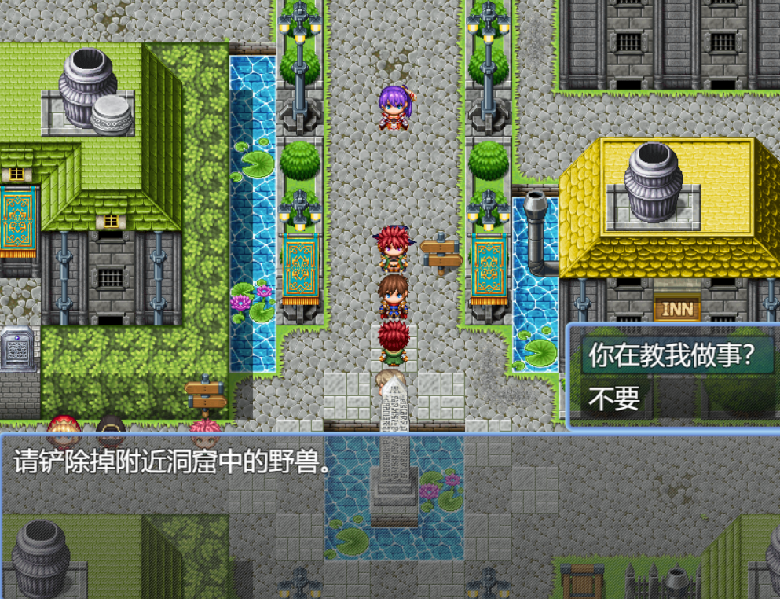

# 策划训练营week4
## 本策划案所有图片仅供参考，图片内容不一定完全准确，只用于提供思路
### 1.游戏简介：
- 名字：legend
- 类型：俯视角2D平面回合制RPG
- 玩法概况：玩家在游戏中触发一系列的事件，最终使用获取的道具打倒怪物与魔王
- 目标群体：对RPG有着一定经验的人，偏爱短篇与创意游戏的人，~~没玩过垃圾游戏的人~~
- 游戏运行平台：电脑端、移动端
### 2.游戏系统介绍
- 任务/引导系统：本作的任务设置以简明扼要为主，在城中设置npc，与其对话获取任务，获得道具，了解游戏道具的获取方式

- 游戏的战斗系统：本作采用经典的回合制，一回合一动，释放一次技能切换回合，有部分技能可以为敌人附加debuff，玩家可以自由搭配以获得胜利。
  
- 地图、探索系统：本作的敌人以明雷机制出现，玩家接触即进入战斗。地图上也会有一些场景互动要素，如可推动的石块，拉杆和门等，玩家需要与地图交互才可推动游戏流程
  
  
- 养成、数值系统：基本等同于没有，数值主要为了游戏流程服务，合理性暂缓
- 游戏的核心机制与玩法：通过交互与道具推进游戏流程，通过游戏剧情上的反馈吸引玩家的兴趣。完成任务、收集要素、利用获得的道具打败魔王，解锁多个结局。
### 3.游戏的美术风格
- 经典日式rpg，地图与人物立绘如图

### 4.游戏的故事背景

- 在悠远的抽象大陆，魔族与人类平分着这片土地。为了生存所需的资源，双方进行了上百年的战争，主角是一个年轻的冒险者，他接受村民的委托，讨伐村子附近的恶龙。
### 5.游戏流程介绍
1. 一周目，玩家在村子里，与村民互动接受委托，获得血瓶、护盾等道具，并根据引导在村中找到宝箱，与妻子道别后毅然决然地前去讨伐恶龙。结果因为实力不足，连第一个小怪都没打过，gameover。
2. 二周目，主角睁开眼，发现自己回到了家中，疑惑的妻子抛出关心的话语。主角痛定思痛，再次向村民咨询。
   此时一位不明老者轻拽他的衣角，告诉了村民让他送死以霸占他的家产和妻子的险恶用心。在老者的指点下，主角来到了一处地牢，打败了地牢中的小怪，获得了“全村最好的剑”。
   主角装备上了全村最好的剑，实力大涨，又一次来到了洞穴，轻松拿捏小怪，但在与恶龙的对峙中败下阵来，他再次陷入昏迷。
3. 三周目，主角再次醒来，妻子握着他的手，表达了自己的思念与祝愿。主角经历了前两次的死亡，深感无力，他没有立刻出村讨伐恶龙，而是在家中渡过了最后一晚。
   第二天，主角迎着朝阳苏醒，但家中的妻子却不见踪影，他在村里问了一圈，得知妻子向着巨龙洞穴的方向离开，主角决定前往洞穴一探究竟，村长敬佩他的决心，为他献上全村最好的剑。
   主角到达巨龙洞穴，发现了失散的妻子，妻子加入战斗队伍，与主角一同对抗怪物。当他们走到洞口时，巨龙拦住了他们的去路，在妻子的协助下（战斗系统可表现），主角战胜了恶龙。恶龙濒死之际，警告主角小心身后的她。妻子上前，捡起巨龙掉落的核心，向主角莞尔一笑，强烈的白光淹没了主角的视线。
4. 四周目，主角回到家中，妻子背对着自己。屋外欢呼声不绝于耳，村民歌颂着主角打倒巨龙的功绩。主角望向妻子手中的巨龙核心，将一直以来的疑问脱口而出。妻子承认自己是一切的始作俑者，她的真实身份不是人类，而是魔王，她将主角原有的妻子变为恶龙，自己取而代之。
5. 结局一：主角选择复仇，这一次他没有先前冒险的道具，以最弱的形态迎战最强的魔王。（进入战斗）魔王一击打空血条，仅留下最后一滴血，而后无动于衷，三回合后主角不出意外的败下阵来。
   （回到游戏场景）魔王上前，主角将利刃对准她毫无防备的胸口，她的双臂轻轻怀抱主角，在送出了最后一个拥抱后倒在了血泊中。只留下孤零零的核心水晶，昭示着她曾存在过。
6. 结局二：主角意识到自己杀死了妻子，满溢的罪恶感在空荡荡的屋子里回响，魔王上前抱住她，说自己是他的共犯，在一片喧哗的村子中，这间小屋显得有些格格不入。
   主角与“妻子”踏上了讨伐魔物之路，在他看来，这是一种赎罪的方式。在人魔相争的时间尽头，魔王永远地消失在了历史的长河中，谁也不知道有这么一段往事。某年某日，一名男孩造访一户人家，主人是一位年轻貌美的少女，她向少年讲述勇者斗恶龙的往事。

### 6.文案策划的一些碎碎念：

我已经加入了一个开发小组，在组里，我是一位文案策划，负责的更多的是文字、剧情方面的工作。所以对游戏的整体协调没有什么经验。由于我自身偏爱剧情向的游戏，也倾向于游戏玩法为剧情让路，我想将本作的战斗、数值都作为游戏演出的一部分，完成游戏的演出效果是第一任务，而不是保证它自身有合理的数值系统，或是策略深度。

例如玩家一周目装备上普通的剑，攻击可能就只有10，但全村最好的剑可以让他的攻击攀升到500，这如此巨大的数值差异才能带来体验上的差异。即剧情中小怪都打不过到轻松拿捏小怪。

如此设计也可以使游戏流程更加可控，但随机带来的乐趣可能就会有所缺失

### 7.游戏开发需求
#### 程序侧：
1. 人物的移动及场景交互：
- 八向移动：wasd控制上下左右，同时按下两个横纵向按键实现侧方位移动，速度为2格/秒。
- 奔跑：移动时按下shift键，速度翻倍，为4格/秒
- 与场景的互动：当玩家面向石头，按下e键和对应的方向键可以推动石头
- 按下f键与npc、事件互动。
2. 战斗系统：半即时回合制战斗
- 交互：由鼠标控制，单机左键以确认释放技能和选中敌人，单机右键表示取消，退回之前的指令，在战斗选择界面单机右键无用
- 我方战斗选择：玩家控制主角一个角色，在行动条叠满后可以执行战斗选择
主要是看战斗选择的部分↓
- 
- 用行动条决定出手：双方都会有一个显示的行动条，行动条填充的速度与角色/怪物的速度呈正相关，行动条叠满后可以执行行动。
- 血量的增减、与ui的联动、攻击、防御等功能的实现
- 
3. 菜单：做一个菜单，用鼠标进行交互，将鼠标移到道具上方，会出现道具的信息，在里面用右键键选中道具，出现使用和丢弃的选项，

#### 美术侧：
1. 人物设计：人物的日常立绘，像素小人的设计
- 主角：身着盔甲的少年，脸上带着生气与朝气。
- 
- 妻子：着装整体偏朴素，在装饰上将特点突出（比如用花的头饰），风格偏中世纪幻想
以我的尤斯蒂娅老婆为例↓（在私货里加了一些策划案）

2. 战斗相关：
- 怪物形象设计：包括像素小人和战斗/对话的立绘
- 技能的特效：普通攻击、技能、回血、强化

3. 游戏的ui设计:
- 打开菜单界面，应该出现道具、装备等选项，显示人物的血量、蓝量等信息
  
  图1 菜单的第一层示例
-  进入道具界面，可以像图2一样分类，重要道具，战斗道具，解谜道具等
  
  图2 菜单的第二层示例
4. 根据场景绘制游戏cg
### 8.其他可能出现的问题：
配乐/音效：免费素材(
部分没有提及的游戏组成部分：由后续商讨得出

